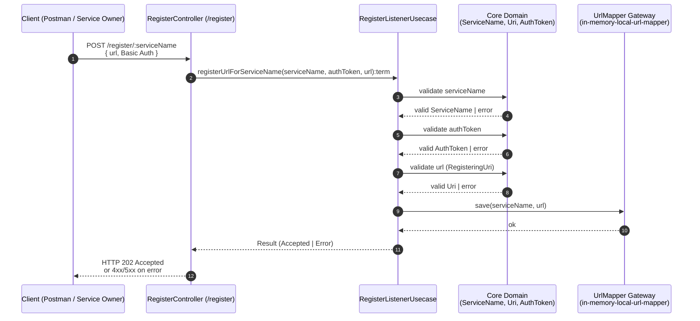
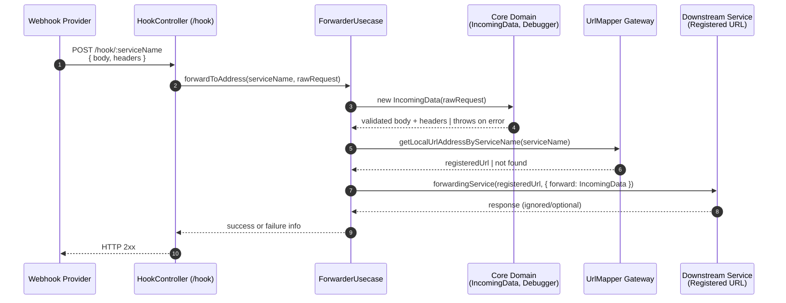

# Outbound Webhook – Gateway

A clean-architecture–based **Webhook Gateway Service** that dynamically registers and forwards inbound webhook requests to locally mapped services.

This project is designed to behave like a **mini API gateway** for webhooks, where services can:

1. Register themselves with a name + URL.
2.Receive forwarded webhook traffic through the gateway.

Built with:

- TypeScript
- Node.js
- Clean Architecture (Ports & Adapters)

## 🧱 Project Architecture

The project follows a **Clean Architecture** structure:

```
src/
│
├── core/                  # Pure business logic
│   ├── forward-debugger.ts
│   ├── incoming-data.ts
│   ├── register-listener-debugger.ts
│   ├── registering-auth-token.ts
│   ├── registering-service-name.ts
│   └── registering-uri.ts
│
├── frameworks-drivers/    # Framework level integrations
│
├── interface-adapters/
│   ├── controllers/
│   │   ├── hook.ts
│   │   └── register.ts
│   ├── gateways/
│   │   ├── in-memory-local-url-mapper.ts
│   │   ├── mock.forwarding.ts
│   │   ├── mock.health.beat.ts
│   │   └── password.store.ts
│   └── presenters/
│
├── ports/                 # Abstractions (interfaces)
│   ├── forwarder.ts
│   └── registering-listener.ts
│
├── usecase/               # Application business flow
│   ├── forwarder.ts
│   └── register-listener.ts
│
└── tests
    ├── core.test.ts
    └── usecase.test.ts

```
## 🔄 How the System Works

### 1. Register a Service

A downstream system registers itself via:

```
POST /register/:serviceName
```

Body:

```json
{
  "url": "http://localhost:3000"
}
```
Basic Auth is required.
✅ This saves the service URL into an in-memory store.

### 2. Receive Webhook

Webhook providers hit:

```
POST /hook/:serviceName
```
This triggers:

```
controller → usecase → core → gateway → forwarding
```
The gateway:

- Resolves service name → URL
- Validates payload
- Forwards the request to the registered URL

## ⚙️ Local Development

### Install

```
npm install
```

### Run in dev

```
npm run build
npm start
```

### Run tests

```
npm test
```

### 🧪 Postman / API Testing

Your Postman collection lives here:
```
docs/Webhooks_Gateway.postman_collection.json
```

You can run it via Newman:
```
npm run postman
```

If you don’t have Newman installed:
```
npm install -D newman
```
### 1️⃣ Register Service Flow (POST /register/:serviceName)



### 2️⃣ Webhook Forward Flow (POST /hook/:serviceName)

